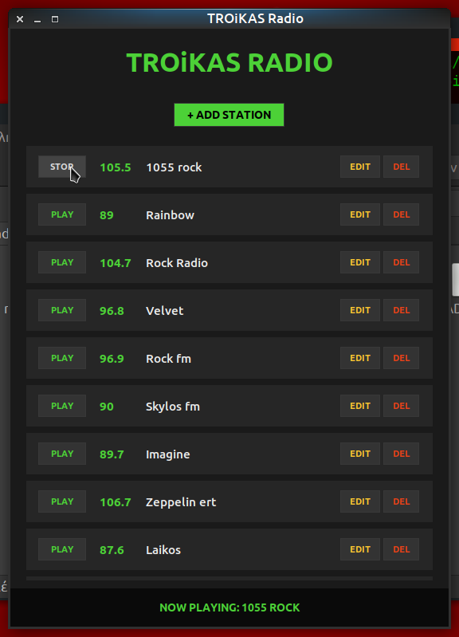

# TROiKAS Radio 📻



[English](#english) | [Ελληνικά](#greek)

---

<a name='english'></a>
## English
A lightweight Internet Radio application built with Python.

### 🚀 Features
* **Station Management:** Add, edit, and delete radio streams.
* **VLC Engine:** Playback via python-vlc.

### 📥 Installation
1. git clone https://github.com/troikas/troikas-radio.git
2. python3 radio.py

---

<a name='greek'></a>
## Ελληνικά
Εφαρμογή διαδικτυακού ραδιοφώνου σε Python.

### 🛠 Προαπαιτούμενα
* Python 3 & VLC Player
* pip install python-vlc

### ⚖ License
MIT License - Copyright (c) 2024

## ⚙️ Ρύθμιση Σταθμών (Configuration)
Η εφαρμογή διαβάζει τους σταθμούς από ένα αρχείο JSON. Για να λειτουργήσει σωστά, πρέπει να τοποθετήσετε το αρχείο radio_stations.json στην παρακάτω διαδρομή:

`~/.config/troikas-radio/radio_stations.json`

### Παράδειγμα Δομής JSON:
```json
{
  "radio_stations": [
    {
      "freq": "105.5",
      "title": "1055 rock",
      "src": "http://radio.1055rock.gr:30000/1055"
    }
  ]
}
```
